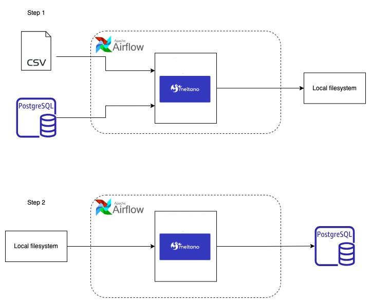

# Desafio de Código - Indicium Tech

Desafio para Desenvolvedor de Software com foco em projetos de dados.

---

## Contexto

Na Indicium, trabalhamos em diversos projetos onde desenvolvemos pipelines de dados completos para nossos clientes, desde a extração de dados de múltiplas fontes até o carregamento em seu destino final. Esse destino pode variar de um _data warehouse_ para ferramentas de Business Intelligence a uma API para integração com sistemas externos.

Como desenvolvedor de software com foco em projetos de dados, sua missão é planejar, desenvolver, implantar e manter um pipeline de dados robusto e escalável.

---

## O Desafio

Você receberá duas fontes de dados: 
1. Um banco de dados **PostgreSQL** (Northwind). 
2. Um arquivo **CSV** com detalhes de pedidos de um sistema de e-commerce.

### Detalhes Técnicos:
- **Banco de Dados Northwind**: É um banco de dados educacional da Microsoft. A tabela `order_details` não está presente no PostgreSQL fornecido e é representada pelo arquivo CSV.
- **Arquivo CSV**: Contém a tabela `order_details`, onde cada linha possui um campo `order_id` que referencia a tabela `orders` do PostgreSQL.

**Esquema do Banco Northwind Original**:  


---

## Objetivo

Construir um pipeline que:
1. **Extraia dados diariamente** de ambas as fontes e os salve em disco local.
2. **Carregue os dados** do disco local para um banco PostgreSQL de destino.

### Requisitos Técnicos:
1. **Isolamento das Etapas**:
   - A escrita em disco (etapa 1) e o carregamento no PostgreSQL (etapa 2) devem ser independentes. Você deve poder executar cada etapa separadamente.
   - A etapa 2 só deve ser executada se a etapa 1 for concluída com sucesso.

2. **Organização de Arquivos**:
   - Crie uma estrutura de pastas por fonte, tabela e data de execução. Exemplo:
     ```
     /data/postgres/{tabela}/2024-01-01/arquivo.extensão
     /data/csv/2024-01-01/arquivo.extensão
     ```
   - Escolha um formato de arquivo adequado (JSON, CSV, Parquet, etc.) e justifique sua escolha.

3. **Reprocessamento**:
   - O pipeline deve aceitar uma data como argumento para reprocessar dados de dias anteriores.

4. **Saída Final**:
   - Execute uma consulta que una as tabelas `orders` (PostgreSQL) e `order_details` (CSV) para mostrar pedidos e seus detalhes. Inclua o resultado em um arquivo (CSV/JSON) como evidência.

---

## Diagrama da Solução

Ferramentas obrigatórias:
- **Orquestração**: [Apache Airflow](https://airflow.apache.org/).
- **ETL/ELT**: [Embulk](https://www.embulk.org) (Java) **ou** [Meltano](https://meltano.com) (Python).
- **Banco de Dados**: [PostgreSQL](https://www.postgresql.org).



---

## Critérios de Avaliação

- **Código Limpo**: Organização, modularização e documentação.
- **Decisões Técnicas**: Justificativa de escolhas (formato de arquivo, ferramentas, etc.).
- **Idempotência**: Executar o pipeline múltiplas vezes não deve alterar o resultado final.
- **Clareza de Falhas**: Identificação precisa de erros em cada etapa.
- **Instruções de Execução**: Passos claros para reproduzir a solução.

---

## Como Executar

1. **Preparação**:
   - Instale o Airflow, Meltano/Embulk e PostgreSQL.
   - Clone o repositório e configure as variáveis de ambiente.

2. **Pipeline**:
   ```bash
   # Executar etapa 1 (extração para disco)
   airflow tasks run extract_to_local 2024-01-01

   # Executar etapa 2 (carregamento para PostgreSQL)
   airflow tasks run load_to_postgres 2024-01-01