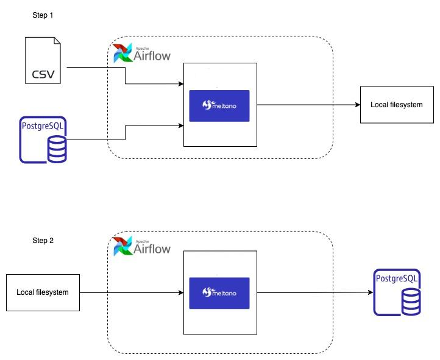
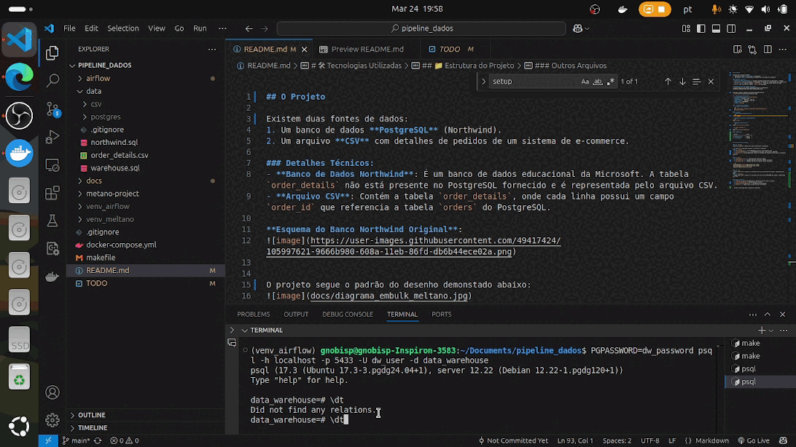

## O Projeto

Existem duas fontes de dados: 
1. Um banco de dados **PostgreSQL** (Northwind). 
2. Um arquivo **CSV** com detalhes de pedidos de um sistema de e-commerce.

### Detalhes Técnicos:
- **Banco de Dados Northwind**: É um banco de dados educacional da Microsoft. A tabela `order_details` não está presente no PostgreSQL fornecido e é representada pelo arquivo CSV.
- **Arquivo CSV**: Contém a tabela `order_details`, onde cada linha possui um campo `order_id` que referencia a tabela `orders` do PostgreSQL.

**Esquema do Banco Northwind Original**:  


O projeto segue o padrão do desenho demonstado abaixo:


# Preview 🖥️ 

# 🛠 Tecnologias Utilizadas 
- **Sistema Operacional**: [Linux-Ubuntu] 
- **Python**: [python3 3.10] 
- **Scheduler:**: [Airflow - 2.10.4] 
- **Data Loader**: [Meltano- 3.10.16]
- **Database**: POSTGRESQL
- **IDE**: [VSCode]

## 🚀 Como rodar o Projeto
  - **Clone o repositório:**
```sh
  git clone https://github.com/gnobisP/code-challenge.git
  cd pipeline_dados
```
### 🐧 Linux:
  - **Instalando dependências:**
```sh
  make setup
```
- **Rodando extratores separadamente**
```sh
make run-etl
```
- **Rodando todo projeto**
```sh
make start-airflow-scheduler:
```
- **`Novo terminal`**
 ```sh
make start-airflow-webserver
```
### Credênciais

| Acesso             | Valor    |
|--------------------|----------|
| **👤 Usuário**     | Admin    |
| **🔐 Senha**       | 123456   |


## 📁 Estrutura do Projeto

### 📂 `airflow`
Contém os arquivos responsáveis pela arquitetura do pipeline

- **`dag.py`**: dag para executar e controlar o pipeline
#### 📂 `script`
- **`extratorCSV.sh`**: script BASH para relizar a extração do CSV
- **`extratorPOSTGREE.sh`**: script BASH para relizar a extração do POSTGREE
- **`fase2.sh`**: script BASH para relizar a extração dos arquivos locais para o warehouse postgres
---

### 📂 `data`
- **`order_details.csv`**: Planilha que contém as ordens.
- **`northwind.sql`**: Comandos SQL para incializar BD da northwind.
- **`warehouse.sql`**: Comandos SQL para incializar BD da warehouse.

```sh
/data/postgres/{table}/2024-01-01/file.format
/data/postgres/{table}/2024-01-02/file.format
/data/csv/2024-01-02/file.format
```

#### 📂 `csv`
- Local onde estará contido os resultado final do extratorCSV da etapa1, subdividida por data.
#### 📂 `postgres`
- Local onde estará contido os resultado final do extratorPOSTGREE da etapa1, subdividida por data.
---

### Outros Arquivos
- **`TODO.md`**: Lista de pendências e melhorias futuras para o projeto.
- **`airflow/README.md`**: Documentação do airflow.
- **`metano-project/README.md`**: Documentação do meltano.
- **`makefile`**: Regras para instalações das ferramentas
---

- Projeto realizado para o desafio da Indicium