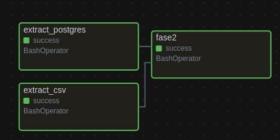

#  INFORMAÇÕES E AJUSTES DA FERRAMENTA

## 🔧 AJUSTES
- Nos scripts, substituir as linhas de código abaixo pelo caminho real do seu projeto

```sh
VENV_PATH="/home/gnobisp/Documents/pipeline_dados/venv_meltano/bin/activate"
PROJECT_PATH="/home/gnobisp/Documents/pipeline_dados/metano-project"
```

## 🚨 Partes importante do airflow
### Credênciais

| Acesso             | Valor    |
|--------------------|----------|
| **👤 Usuário**     | Admin    |
| **🔐 Senha**       | 123456   |

### Comentários
- Todos os scripts devem estar contidos na pasta script, criar subdivisão na pasta script se achar necessário

- Todas as DAGs devem estar na pasta DAG

- No eschema abaixo, a extração do CSV *(extract_csv)* e do banco de dados NORTWIND *(extract_postgres)* são feitas em paralelo. E somente quando as duas forem bem sucedidas, a tarefa de upar os dados no WAREHOUSE *(fase2)* será realizada.




